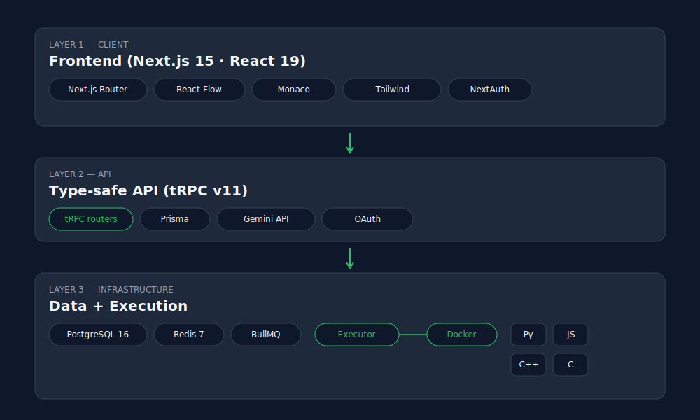

# SKILL Platform — AI 驅動的程式解題與系統設計導師

> **S**ystematic **K**nowledge & **I**ntegrated **L**ogic **L**earning

一個結合 AI 導師與線上評測系統的全端平台，透過蘇格拉底式對話引導使用者練習演算法解題與系統程式設計。內建 Blind 75 完整題庫。

## 特色

- **SKILL 教學框架** — AI 不餵答案，用五階段引導使用者思考：蘇格拉底式引導 → 知識連結 → 疊代優化 → 邏輯驗證 → 長期演化
- **Blind 75 題庫** — 71 道經典面試題，涵蓋 Array、DP、Graph、Tree、String 等 10 大分類
- **即時程式碼執行** — 支援 Python、C、C++、JavaScript，在 Docker 沙盒中安全執行
- **自適應學習路徑** — 知識圖譜驅動的推薦引擎，根據掌握度與弱點智慧推薦下一道題
- **對話式 UI** — 以 AI 導師對話為核心，程式碼編輯器與執行結果內嵌在聊天流中

## 技術棧

| 層級 | 技術 |
|------|------|
| 前端 | Next.js 15, React 19, Tailwind CSS, Monaco Editor |
| API | tRPC v11 (型別安全) |
| 資料庫 | PostgreSQL 16 + Prisma ORM |
| 快取 | Redis 7 |
| AI | Google Gemini 2.0 Flash (免費) |
| 認證 | NextAuth.js v5 (Google/GitHub OAuth) |
| 程式碼執行 | Docker 沙盒 + BullMQ 佇列 |
| 測試 | Vitest |

## 架構

<p align="center">
  
</p>

## 快速開始

### 前置需求

- [Node.js](https://nodejs.org/) 20+
- [Docker Desktop](https://www.docker.com/products/docker-desktop/)
- [Git](https://git-scm.com/)

### 首次設定（一鍵完成）

```bash
git clone https://github.com/chadcoco1444/ai-pair-programmer.git
cd ai-pair-programmer
npm run setup
```

自動完成：安裝依賴 → 啟動 PostgreSQL + Redis → 同步 schema → 匯入 71 道 Blind 75 題目 → 建置語言 Docker 映像

### 設定 API Keys

編輯 `.env` 填入：

```env
# AI 導師（免費：https://aistudio.google.com/apikey）
GEMINI_API_KEY="your-key"

# OAuth 登入（至少設定一個）
GITHUB_CLIENT_ID="..."
GITHUB_CLIENT_SECRET="..."
GOOGLE_CLIENT_ID="..."
GOOGLE_CLIENT_SECRET="..."
```

### 啟動開發環境

```bash
npm run dev:web
```

一鍵啟動 PostgreSQL + Redis + 執行引擎 + Next.js，開啟 http://localhost:3001

## 指令一覽

| 指令 | 用途 |
|------|------|
| `npm run setup` | 首次設定（一鍵完成所有初始化） |
| `npm run dev:web` | 啟動完整開發環境 |
| `npm run stop` | 停止所有 Docker 服務 |
| `npm run test` | 執行所有測試 |
| `npm run db:seed` | 重新匯入種子資料 |
| `npm run db:reset` | 清空 DB 並重新匯入 |
| `npm run db:studio` | 開啟 Prisma Studio |

## 題庫分佈

| 分類 | 題數 | 難度分佈 |
|------|------|----------|
| Array | 10 | 3 Easy, 7 Medium |
| Binary | 5 | 4 Easy, 1 Medium |
| Dynamic Programming | 11 | 1 Easy, 10 Medium |
| Graph | 7 | 7 Medium |
| Heap | 2 | 1 Medium, 1 Hard |
| Interval | 3 | 3 Medium |
| Linked List | 6 | 3 Easy, 2 Medium, 1 Hard |
| Matrix | 4 | 4 Medium |
| String | 10 | 3 Easy, 7 Medium |
| Tree | 13 | 4 Easy, 6 Medium, 3 Hard |
| **合計** | **71** | **18 Easy, 47 Medium, 6 Hard** |

## SKILL 教學框架

```
S (蘇格拉底式引導) → K (知識連結) → I (疊代優化) → L1 (邏輯驗證) → L2 (長期演化)
```

| 階段 | 行為 |
|------|------|
| **S** Socratic | 透過提問了解思路，不假設困難點 |
| **K** Knowledge | 漸進揭示演算法模式，引導自行發現 |
| **I** Iterative | 暴力解 → 瓶頸分析 → 最佳化 |
| **L1** Logic | 殺手測資挑戰，手動推演驗證 |
| **L2** Evolution | 更新掌握度，推薦下一道題 |

## 專案結構

```
ai-pair-programmer/
├── apps/web/                  # Next.js 主應用
│   ├── src/app/               # 頁面 (首頁、題庫、解題、儀表板、個人檔案)
│   ├── src/components/        # React 元件 (對話、編輯器、圖表)
│   ├── src/server/            # tRPC routers + services
│   │   ├── services/          # SKILL 編排器、知識圖譜、自適應學習
│   │   └── routers/           # user, problem, concept, conversation, submission, learning
│   ├── src/hooks/             # useChat (SSE), useSubmission
│   └── prisma/                # Schema + Seed
├── services/executor/         # 沙盒執行引擎
│   ├── src/                   # Express API + BullMQ Worker + Docker 沙盒
│   └── images/                # 語言 Docker 映像 (Python, C/C++, JS)
├── packages/shared/           # 共享型別與常數
├── seed/                      # 題庫 + 知識圖譜 YAML
├── scripts/                   # setup.mjs, dev.mjs, stop.mjs
└── docker-compose.yml
```

## License

MIT
